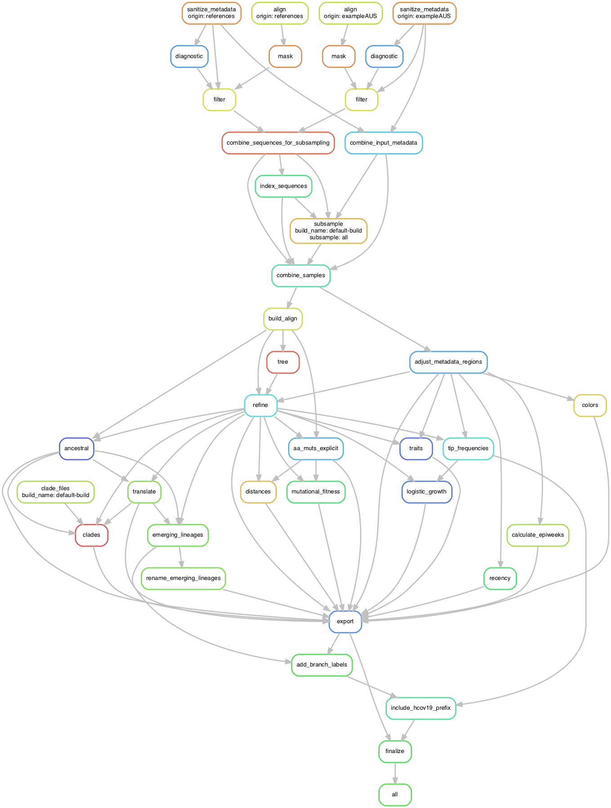

# Using Nextstrain

An attempt to setup and run Nextstrain on MacOS

```
# Install Augur
pip install nextstrain-augur

# Install nextstrain-ci, will need docker
python3 -m pip install nextstrain-cli
```

## Running the Zika tutorial

* https://nextstrain.org/docs/getting-started/zika-tutorial

```
# Fetch and Run
git clone https://github.com/nextstrain/zika-tutorial.git
cd zika-tutorial

mkdir -p results/

augur filter \
  --sequences data/sequences.fasta \
  --metadata data/metadata.tsv \
  --exclude config/dropped_strains.txt \
  --output results/filtered.fasta \
  --group-by country year month \
  --sequences-per-group 20 \
  --min-date 2012

augur align \
  --sequences results/filtered.fasta \
  --reference-sequence config/zika_outgroup.gb \
  --output results/aligned.fasta \
  --fill-gaps

PATH=$PATH:~/bin/

augur tree \
  --method fasttree
  --alignment results/aligned.fasta \
  --output results/tree_raw.nwk

augur refine \
  --tree results/tree_raw.nwk \
  --alignment results/aligned.fasta \
  --metadata data/metadata.tsv \
  --output-tree results/tree.nwk \
  --output-node-data results/branch_lengths.json \
  --timetree \
  --coalescent opt \
  --date-confidence \
  --date-inference marginal \
  --clock-filter-iqd 4

augur traits \
  --tree results/tree.nwk \
  --metadata data/metadata.tsv \
  --output results/traits.json \
  --columns region country \
  --confidence

augur ancestral \
  --tree results/tree.nwk \
  --alignment results/aligned.fasta \
  --output results/nt_muts.json \
  --inference joint

augur translate \
  --tree results/tree.nwk \
  --ancestral-sequences results/nt_muts.json \
  --reference-sequence config/zika_outgroup.gb \
  --output results/aa_muts.json

augur export \
  --tree results/tree.nwk \
  --metadata data/metadata.tsv \
  --node-data results/branch_lengths.json \
              results/traits.json \
              results/nt_muts.json \
              results/aa_muts.json \
  --colors config/colors.tsv \
  --auspice-config config/auspice_config.json \
  --output-tree auspice/zika_tree.json \
  --output-meta auspice/zika_meta.json

#nextstrain view auspice/
```

Copy the url into your browser to view the files

# Restart - 2021/10/06

* Neher, R.A. and Bedford, T., 2015. [Nextflu: real-time tracking of seasonal influenza virus evolution in humans](https://api.semanticscholar.org/CorpusID:880543). Bioinformatics, 31(21), pp.3546-3548.
* Hadfield, J., Megill, C., Bell, S.M., Huddleston, J., Potter, B., Callender, C., Sagulenko, P., Bedford, T. and Neher, R.A., 2018. [Nextstrain: real-time tracking of pathogen evolution](https://api.semanticscholar.org/CorpusID:8134099). Bioinformatics, 34(23), pp.4121-4123.
* Huddleston, J., Hadfield, J., Sibley, T.R., Lee, J., Fay, K., Ilcisin, M., Harkins, E., Bedford, T., Neher, R.A. and Hodcroft, E.B., 2021. [Augur: a bioinformatics toolkit for phylogenetic analyses of human pathogens](https://api.semanticscholar.org/CorpusID:233312899). Journal of Open Source Software, 6(57), p.2906.

* Other Papers: 
  [2020_Bedford](https://api.semanticscholar.org/CorpusID:215782250)
| [2020_Kim](https://api.semanticscholar.org/CorpusID:215718870)
| [2020_Chu](https://api.semanticscholar.org/CorpusID:222235769)

* Installation Instructions: https://docs.nextstrain.org/en/latest/install.html

```
# conda method on an 13in MacBook Pro 2016 (MacOS 11.6)
conda create -n nextstrain -c conda-forge -c bioconda \
  augur auspice nextstrain-cli nextalign snakemake awscli git pip
  
#hmm, conda is taking over an hour on my machine. Try mamba method
conda install -n base -c conda-forge mamba
mamba create -n nextstrain -c conda-forge -c bioconda \
  augur auspice nextstrain-cli nextalign snakemake awscli git pip

# Check install
conda activate nextstrain
pip install epiweeks
nextstrain check-setup --set-default
```

<details><summary>see output</summary>

```
nextstrain-cli is up to date!

Testing your setup…

# docker is not supported
✘ no: docker is installed
✘ no: docker run works
? unknown: containers have access to >2 GiB of memory
✔ yes: image is new enough for this CLI version

# native is supported
✔ yes: snakemake is installed
✔ yes: augur is installed
✔ yes: auspice is installed

# aws-batch is not supported
✘ no: job description "nextstrain-job" exists
✘ no: job queue "nextstrain-job-queue" exists
✘ no: S3 bucket "nextstrain-jobs" exists

All good!  Supported Nextstrain environments: native

Setting default environment to native.
```

going to try avoiding docker (always end up with large containers), but if I need it will install

</details>

Run a demo

```
git clone https://github.com/nextstrain/ncov
```

data prep (scripted? I guess already prepped in the database download)

Preferred workflow language = snakemake

Snakemake's `defaults` and `my_profiles` probably equivalent to Nextflow's `nextflow.config` and `config` folder.

```
cd ncov
emacs builds.yaml
```

**build.yml**  defaults

Was originally using Aus, switched to default example.

```
# Define inputs

inputs:
  - name: example
    metadata: data/example_metadata.tsv
    sequences: data/example_sequences.fasta.gz
  - name: references
    metadata: data/references_metadata.tsv
    sequences: data/references_sequences.fasta
```

```
nextstrain build . --configfiles builds.yaml --cores 1 -n -p --dag | dot -Tpng > dag.png
```



```
nextstrain build . --configfiles builds.yaml --cores 1
```

<details><summary>output, may need to adjust build config</summary>
  
  ```
  Building DAG of jobs...
Using shell: /bin/bash
Provided cores: 1 (use --cores to define parallelism)
Rules claiming more threads will be scaled down.
Conda environments: ignored
Job stats:
job                                  count    min threads    max threads
---------------------------------  -------  -------------  -------------
aa_muts_explicit                         1              1              1
add_branch_labels                        1              1              1
adjust_metadata_regions                  1              1              1
align                                    1              1              1
all                                      1              1              1
ancestral                                1              1              1
build_align                              1              1              1
calculate_epiweeks                       1              1              1
clades                                   1              1              1
colors                                   1              1              1
combine_input_metadata                   1              1              1
combine_samples                          1              1              1
combine_sequences_for_subsampling        1              1              1
diagnostic                               1              1              1
distances                                1              1              1
emerging_lineages                        1              1              1
export                                   1              1              1
filter                                   2              1              1
finalize                                 1              1              1
include_hcov19_prefix                    1              1              1
index_sequences                          1              1              1
logistic_growth                          1              1              1
mask                                     2              1              1
mutational_fitness                       1              1              1
recency                                  1              1              1
refine                                   1              1              1
rename_emerging_lineages                 1              1              1
sanitize_metadata                        1              1              1
subsample                                1              1              1
tip_frequencies                          1              1              1
traits                                   1              1              1
translate                                1              1              1
tree                                     1              1              1
total                                   35              1              1

Select jobs to execute...

[Wed Oct  6 14:20:57 2021]
rule sanitize_metadata:
    input: data/example_metadata_aus.tsv.xz
    output: results/sanitized_metadata_exampleAUS.tsv.xz
    log: logs/sanitize_metadata_exampleAUS.txt
    jobid: 13
    benchmark: benchmarks/sanitize_metadata_exampleAUS.txt
    wildcards: origin=exampleAUS
    resources: tmpdir=/var/folders/wt/gw5b79wn4sjcpny6d0x4p1680000gn/T, mem_mb=2000


        python3 scripts/sanitize_metadata.py             --metadata data/example_metadata_aus.tsv.xz             --metadata-id-columns strain name 'Virus name'             --database-id-columns 'Accession ID' gisaid_epi_isl genbank_accession             --parse-location-field Location             --rename-fields 'Virus name=strain' Type=type 'Accession ID=gisaid_epi_isl' 'Collection date=date' 'Additional location information=additional_location_information' 'Sequence length=length' Host=host 'Patient age=patient_age' Gender=sex Clade=GISAID_clade 'Pango lineage=pango_lineage' pangolin_lineage=pango_lineage Lineage=pango_lineage 'Pangolin version=pangolin_version' Variant=variant 'AA Substitutions=aa_substitutions' aaSubstitutions=aa_substitutions 'Submission date=date_submitted' 'Is reference?=is_reference' 'Is complete?=is_complete' 'Is high coverage?=is_high_coverage' 'Is low coverage?=is_low_coverage' N-Content=n_content GC-Content=gc_content             --strip-prefixes hCoV-19/ SARS-CoV-2/                          --output results/sanitized_metadata_exampleAUS.tsv.xz 2>&1 | tee logs/sanitize_metadata_exampleAUS.txt
        
ERROR: None of the possible database id columns (['Accession ID', 'gisaid_epi_isl', 'genbank_accession']) were found in the metadata's columns ('strain', 'date', 'region', 'country', 'division')
Waiting at most 5 seconds for missing files.
MissingOutputException in line 1 of /Users/jenchang/Desktop/2021_Test/ncov/workflow/snakemake_rules/main_workflow.smk:
Job Missing files after 5 seconds:
results/sanitized_metadata_exampleAUS.tsv.xz
This might be due to filesystem latency. If that is the case, consider to increase the wait time with --latency-wait.
Job id: 13 completed successfully, but some output files are missing. 13
Shutting down, this might take some time.
Exiting because a job execution failed. Look above for error message
Complete log: /Users/jenchang/Desktop/2021_Test/ncov/.snakemake/log/2021-10-06T142056.352376.snakemake.log
  ```

</details>
