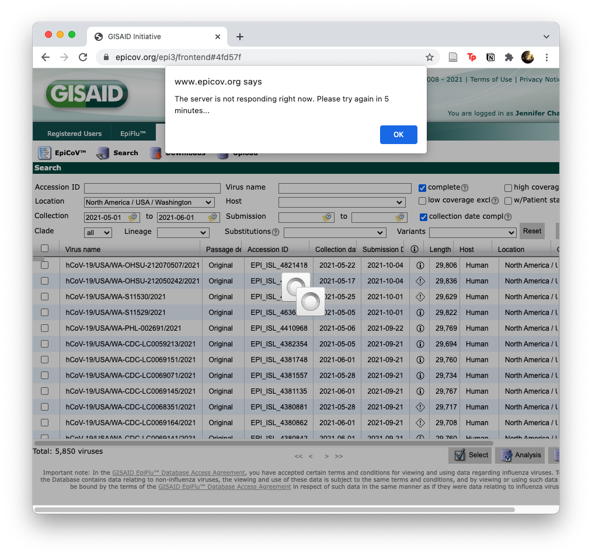

# Using Nextstrain

## Background

* Neher, R.A. and Bedford, T., 2015. [Nextflu: real-time tracking of seasonal influenza virus evolution in humans](https://api.semanticscholar.org/CorpusID:880543). Bioinformatics, 31(21), pp.3546-3548.
* Hadfield, J., Megill, C., Bell, S.M., Huddleston, J., Potter, B., Callender, C., Sagulenko, P., Bedford, T. and Neher, R.A., 2018. [Nextstrain: real-time tracking of pathogen evolution](https://api.semanticscholar.org/CorpusID:8134099). Bioinformatics, 34(23), pp.4121-4123.
* Huddleston, J., Hadfield, J., Sibley, T.R., Lee, J., Fay, K., Ilcisin, M., Harkins, E., Bedford, T., Neher, R.A. and Hodcroft, E.B., 2021. [Augur: a bioinformatics toolkit for phylogenetic analyses of human pathogens](https://api.semanticscholar.org/CorpusID:233312899). Journal of Open Source Software, 6(57), p.2906.

* Other Papers: 
  [2020_Bedford](https://api.semanticscholar.org/CorpusID:215782250)
| [2020_Kim](https://api.semanticscholar.org/CorpusID:215718870)
| [2020_Chu](https://api.semanticscholar.org/CorpusID:222235769)

* [ ] Forum: https://discussion.nextstrain.org/

* Installation Instructions: https://docs.nextstrain.org/en/latest/install.html

## Prior Notes

<details><summary>Notes from 28 Sept 2018</summary>

```
# Install Augur
pip install nextstrain-augur

# Install nextstrain-ci, will need docker
python3 -m pip install nextstrain-cli
```

## Running the Zika tutorial

* https://nextstrain.org/docs/getting-started/zika-tutorial

```
# Fetch and Run
git clone https://github.com/nextstrain/zika-tutorial.git
cd zika-tutorial

mkdir -p results/

augur filter \
  --sequences data/sequences.fasta \
  --metadata data/metadata.tsv \
  --exclude config/dropped_strains.txt \
  --output results/filtered.fasta \
  --group-by country year month \
  --sequences-per-group 20 \
  --min-date 2012

augur align \
  --sequences results/filtered.fasta \
  --reference-sequence config/zika_outgroup.gb \
  --output results/aligned.fasta \
  --fill-gaps

PATH=$PATH:~/bin/

augur tree \
  --method fasttree
  --alignment results/aligned.fasta \
  --output results/tree_raw.nwk

augur refine \
  --tree results/tree_raw.nwk \
  --alignment results/aligned.fasta \
  --metadata data/metadata.tsv \
  --output-tree results/tree.nwk \
  --output-node-data results/branch_lengths.json \
  --timetree \
  --coalescent opt \
  --date-confidence \
  --date-inference marginal \
  --clock-filter-iqd 4

augur traits \
  --tree results/tree.nwk \
  --metadata data/metadata.tsv \
  --output results/traits.json \
  --columns region country \
  --confidence

augur ancestral \
  --tree results/tree.nwk \
  --alignment results/aligned.fasta \
  --output results/nt_muts.json \
  --inference joint

augur translate \
  --tree results/tree.nwk \
  --ancestral-sequences results/nt_muts.json \
  --reference-sequence config/zika_outgroup.gb \
  --output results/aa_muts.json

augur export \
  --tree results/tree.nwk \
  --metadata data/metadata.tsv \
  --node-data results/branch_lengths.json \
              results/traits.json \
              results/nt_muts.json \
              results/aa_muts.json \
  --colors config/colors.tsv \
  --auspice-config config/auspice_config.json \
  --output-tree auspice/zika_tree.json \
  --output-meta auspice/zika_meta.json

#nextstrain view auspice/
```

Copy the url into your browser to view the files
  
</details>

<details><summary>Notes from 6 Oct 2021</summary>

```
# conda method on an 13in MacBook Pro 2016 (MacOS 11.6)
conda create -n nextstrain -c conda-forge -c bioconda \
  augur auspice nextstrain-cli nextalign snakemake awscli git pip
  
#hmm, conda is taking over an hour on my machine. Try mamba method
conda install -n base -c conda-forge mamba
mamba create -n nextstrain -c conda-forge -c bioconda \
  augur auspice nextstrain-cli nextalign snakemake awscli git pip

# Check install
conda activate nextstrain
pip install epiweeks
nextstrain check-setup --set-default
```

<details><summary>see output</summary>

```
nextstrain-cli is up to date!

Testing your setup…

# docker is not supported
✘ no: docker is installed
✘ no: docker run works
? unknown: containers have access to >2 GiB of memory
✔ yes: image is new enough for this CLI version

# native is supported
✔ yes: snakemake is installed
✔ yes: augur is installed
✔ yes: auspice is installed

# aws-batch is not supported
✘ no: job description "nextstrain-job" exists
✘ no: job queue "nextstrain-job-queue" exists
✘ no: S3 bucket "nextstrain-jobs" exists

All good!  Supported Nextstrain environments: native

Setting default environment to native.
```

going to try avoiding docker (always end up with large containers), but if I need it will install

</details>

Run a demo

```
git clone https://github.com/nextstrain/ncov
```

data prep (scripted? I guess already prepped in the database download)

Preferred workflow language = snakemake

Snakemake's `defaults` and `my_profiles` probably equivalent to Nextflow's `nextflow.config` and `config` folder.

```
cd ncov
emacs builds.yaml
```

**build.yml**  defaults

Was originally using Aus, switched to default example.

```
# Define inputs

inputs:
  - name: example
    metadata: data/example_metadata.tsv
    sequences: data/example_sequences.fasta.gz
  - name: references
    metadata: data/references_metadata.tsv
    sequences: data/references_sequences.fasta
```

```
nextstrain build . --configfiles builds.yaml --cores 1 -n -p --dag | dot -Tpng > dag.png
```


```
nextstrain build . --configfiles builds.yaml --cores 1
```

<details><summary>AUS output, may need to adjust build config</summary>
  
  ```
  Building DAG of jobs...
Using shell: /bin/bash
Provided cores: 1 (use --cores to define parallelism)
Rules claiming more threads will be scaled down.
Conda environments: ignored
Job stats:
job                                  count    min threads    max threads
---------------------------------  -------  -------------  -------------
aa_muts_explicit                         1              1              1
add_branch_labels                        1              1              1
adjust_metadata_regions                  1              1              1
align                                    1              1              1
all                                      1              1              1
ancestral                                1              1              1
build_align                              1              1              1
calculate_epiweeks                       1              1              1
clades                                   1              1              1
colors                                   1              1              1
combine_input_metadata                   1              1              1
combine_samples                          1              1              1
combine_sequences_for_subsampling        1              1              1
diagnostic                               1              1              1
distances                                1              1              1
emerging_lineages                        1              1              1
export                                   1              1              1
filter                                   2              1              1
finalize                                 1              1              1
include_hcov19_prefix                    1              1              1
index_sequences                          1              1              1
logistic_growth                          1              1              1
mask                                     2              1              1
mutational_fitness                       1              1              1
recency                                  1              1              1
refine                                   1              1              1
rename_emerging_lineages                 1              1              1
sanitize_metadata                        1              1              1
subsample                                1              1              1
tip_frequencies                          1              1              1
traits                                   1              1              1
translate                                1              1              1
tree                                     1              1              1
total                                   35              1              1

Select jobs to execute...

[Wed Oct  6 14:20:57 2021]
rule sanitize_metadata:
    input: data/example_metadata_aus.tsv.xz
    output: results/sanitized_metadata_exampleAUS.tsv.xz
    log: logs/sanitize_metadata_exampleAUS.txt
    jobid: 13
    benchmark: benchmarks/sanitize_metadata_exampleAUS.txt
    wildcards: origin=exampleAUS
    resources: tmpdir=/var/folders/wt/gw5b79wn4sjcpny6d0x4p1680000gn/T, mem_mb=2000


        python3 scripts/sanitize_metadata.py             --metadata data/example_metadata_aus.tsv.xz             --metadata-id-columns strain name 'Virus name'             --database-id-columns 'Accession ID' gisaid_epi_isl genbank_accession             --parse-location-field Location             --rename-fields 'Virus name=strain' Type=type 'Accession ID=gisaid_epi_isl' 'Collection date=date' 'Additional location information=additional_location_information' 'Sequence length=length' Host=host 'Patient age=patient_age' Gender=sex Clade=GISAID_clade 'Pango lineage=pango_lineage' pangolin_lineage=pango_lineage Lineage=pango_lineage 'Pangolin version=pangolin_version' Variant=variant 'AA Substitutions=aa_substitutions' aaSubstitutions=aa_substitutions 'Submission date=date_submitted' 'Is reference?=is_reference' 'Is complete?=is_complete' 'Is high coverage?=is_high_coverage' 'Is low coverage?=is_low_coverage' N-Content=n_content GC-Content=gc_content             --strip-prefixes hCoV-19/ SARS-CoV-2/                          --output results/sanitized_metadata_exampleAUS.tsv.xz 2>&1 | tee logs/sanitize_metadata_exampleAUS.txt
        
ERROR: None of the possible database id columns (['Accession ID', 'gisaid_epi_isl', 'genbank_accession']) were found in the metadata's columns ('strain', 'date', 'region', 'country', 'division')
Waiting at most 5 seconds for missing files.
MissingOutputException in line 1 of /Users/jenchang/Desktop/2021_Test/ncov/workflow/snakemake_rules/main_workflow.smk:
Job Missing files after 5 seconds:
results/sanitized_metadata_exampleAUS.tsv.xz
This might be due to filesystem latency. If that is the case, consider to increase the wait time with --latency-wait.
Job id: 13 completed successfully, but some output files are missing. 13
Shutting down, this might take some time.
Exiting because a job execution failed. Look above for error message
Complete log: /Users/jenchang/Desktop/2021_Test/ncov/.snakemake/log/2021-10-06T142056.352376.snakemake.log
  ```

</details>

<details><summary> Example output - works!</summary>
  
```
[Fri Oct  8 13:17:59 2021]
localrule all:
    input: auspice/ncov_default-build.json, auspice/ncov_default-build_tip-frequencies.json
    jobid: 0
    resources: tmpdir=/var/folders/wt/gw5b79wn4sjcpny6d0x4p1680000gn/T

[Fri Oct  8 13:17:59 2021]
Finished job 0.
20 of 20 steps (100%) done
Complete log: /Users/jenchang/Desktop/2021_Test/ncov/.snakemake/log/2021-10-08T131055.780644.snakemake.log
```
  
</details>

View dashboard

```
nextstrain view auspice/
```

Output

```

——————————————————————————————————————————————————————————————————————————————
    The following datasets should be available in a moment:
       • http://127.0.0.1:4000/ncov/default-build
——————————————————————————————————————————————————————————————————————————————

[verbose]	Serving index / favicon etc from  "/Users/jenchang/miniconda/envs/nextstrain/lib/auspice/node_modules/auspice"
[verbose]	Serving built javascript from     "/Users/jenchang/miniconda/envs/nextstrain/lib/auspice/node_modules/auspice/dist"


---------------------------------------------------
Auspice server now running at http://127.0.0.1:4000
Serving auspice version 2.29.1
Looking for datasets in /Users/jenchang/Desktop/2021_Test/ncov/auspice
Looking for narratives in /Users/jenchang/miniconda/envs/nextstrain/lib/auspice/node_modules/auspice/narratives
---------------------------------------------------


GET DATASET query received: prefix=/ncov/default-build
GET DATASET query received: prefix=/ncov/default-build&type=tip-frequencies
GET AVAILABLE returning locally available datasets & narratives
[warning]	Couldn't collect available narratives (path searched: /Users/jenchang/miniconda/envs/nextstrain/lib/auspice/node_modules/auspice/narratives)
[verbose]	Error: ENOENT: no such file or directory, scandir '/Users/jenchang/miniconda/envs/nextstrain/lib/auspice/node_modules/auspice/narratives'
GET DATASET query received: prefix=/ncov/default-build&type=root-sequence
```

Navigate to address


</details>

## Tutorial Run - 23 Nov 2021

**Tutorial List**

<!-- quote so I don't get too far off track

Getting started with Nextstrain, taking notes about what works well and what could be improved.
Install Nextstrain (Docker + CLI) 
* Run the Zika tutorial (Snakemake workflow. See Trevor's Nextflow implementation and John's WDL implementation.)
* Run the SARS-CoV-2 tutorial (requires GISAID account)
* Run ncov as internal Nextstrain user (only after working through what it’s like as external user)

-->

1. Nextstrain Installation: https://docs.nextstrain.org/en/latest/install.html
2. Zika Tutorial: https://docs.nextstrain.org/en/latest/tutorials/zika.html
3. SARS-CoV-2 Tutorial: https://docs.nextstrain.org/projects/ncov/en/latest/index.html
  * with a focus on GISAID experience

### 1. Nextstrain Installation

Follow the [instructions](https://docs.nextstrain.org/en/latest/install.html) on a MacBook Pro 13-inch, 2016 (MacOS 11.6 Big Sur). Update XCode, [Miniconda](https://docs.conda.io/en/latest/miniconda.html), [Docker](https://docs.docker.com/desktop/mac/install/) and run through the commands.

I also cleaned out my old conda environments `conda env list; conda env remove -n <environmentname>`. 

```
conda update -n base conda

conda create -n nextstrain -c conda-forge -c bioconda \
  augur auspice nextstrain-cli nextalign snakemake awscli git pip
```

The conda solver is taking a long time again and gets hung up on:

```
Collecting package metadata (current_repodata.json): done
Solving environment: failed with repodata from current_repodata.json, will retry with next repodata source.
Collecting package metadata (repodata.json): done
Solving environment: - 
```

Since we have tabs for "conda" and "docker", maybe we can add a "mamba" tab. 

I have prior co-workers who have switched all their `conda env`s to `mamba env`s because installation is faster. Might be a good idea to promote `mamba` methods. There's an [online article](https://labs.epi2me.io/conda-or-mamba-for-production/#speed) with rough benchmarks showing mamba being faster than conda. 

There's also a smaller footprint version called "micromamba" (does not depend on conda)... hmm, maybe avoid that rabbit hole for now... ([link](https://labs.epi2me.io/conda-or-mamba-for-production/#size))

```
conda install -n base -c conda-forge mamba
```

Shouldn't we update the mamba base before creating a nextstrain environment? Might want to switch the order. 

```
# Update Conda and Mamba.
mamba update -n base conda mamba

mamba create -n nextstrain -c conda-forge -c bioconda \
 augur auspice nextstrain-cli nextalign snakemake awscli git pip

conda activate nextstrain
```

Then check the setup:

```
nextstrain check-setup --set-default

#> A new version of nextstrain-cli, 3.0.4, is available!  You're running 3.0.3.
#> 
#> Upgrade by running:
#> 
#>     python3.9 -m pip install --upgrade nextstrain-cli
#> 
#> Testing your setup…
#> Unable to find image 'hello-world:latest' locally
#> latest: Pulling from library/hello-world
#> 2db29710123e: Pulling fs layer
#> 2db29710123e: Download complete
#> 2db29710123e: Pull complete
#> Digest: sha256:cc15c5b292d8525effc0f89cb299f1804f3a725c8d05e158653a563f15e4f685
#> Status: Downloaded newer image for hello-world:latest
#> 
#> # docker is supported
#> ✔ yes: docker is installed
#> ✔ yes: docker run works
#> ? unknown: containers have access to >2 GiB of memory
#> ✔ yes: image is new enough for this CLI version
#> 
#> # native is supported
#> ✔ yes: snakemake is installed
#> ✔ yes: augur is installed
#> ✔ yes: auspice is installed
#> 
#> # aws-batch is not supported
#> ✘ no: job description "nextstrain-job" exists
#> ✘ no: job queue "nextstrain-job-queue" exists
#> ✘ no: S3 bucket "nextstrain-jobs" exists
#> 
#> All good!  Supported Nextstrain environments: docker, native
#> 
#> Setting default environment to docker.
```

It automatically set the default environment to docker, maybe I can switch it to native? Some `nextstrain -setenvironment native` or similar command? Hmm where's the documentation to switch?

Maybe include a line about the nextstrain help?

```
nextstrain -h
#> usage: nextstrain [-h] {build,view,deploy,remote,shell,update,check-setup,version} ...
#> 
#> Nextstrain command-line interface (CLI)
#> 
#> The `nextstrain` program and its subcommands aim to provide a consistent way to
#> run and visualize pathogen builds and access Nextstrain components like Augur
#> and Auspice across computing environments such as Docker, Conda, and AWS Batch.
#> 
#> optional arguments:
#>   -h, --help            show this help message and exit
#> 
#> commands:
#>   {build,view,deploy,remote,shell,update,check-setup,version}
#>     build               Run pathogen build
#>     view                View pathogen build
#>     deploy              Deploy pathogen build
#>     remote              Upload, download, and manage Nextstrain files on remote sources.
#>     shell               Start a new shell in the build environment
#>     update              Update your local image copy
#>     check-setup         Test your local setup
#>     version             Show version information
```

Darn, if docker is available I can't select native.

Nevermind, `victorlin` found it (thanks!): `nextstrain build --native` at [the end of the CLI installation docs](https://docs.nextstrain.org/projects/cli/en/stable/installation/).

```
nextstrain check-setup -h

#> usage: nextstrain check-setup [-h] [--set-default]
#> 
#> Checks your local setup to see if you have a supported build environment.
#> 
#> Three environments are supported, each of which will be tested:
#> 
#>   • Our Docker image is the preferred build environment.  Docker itself must
#>     be installed and configured on your computer first, but once it is, the
#>     build environment is robust and reproducible.
#> 
#>   • Your native ambient environment will be tested for snakemake, augur, and
#>     auspice. Their presence implies a working build environment, but does not
#>     guarantee it.
#> 
#>   • Remote jobs on AWS Batch.  Your AWS account, if credentials are available
#>     in your environment or via aws-cli configuration, will be tested for the
#>     presence of appropriate resources.  Their presence implies a working AWS
#>     Batch environment, but does not guarantee it.
#> 
#> optional arguments:
#>   -h, --help     show this help message and exit
#>   --set-default  Set the default environment to the first which passes check-setup. Checks run in the order: docker, native, aws-batch. (default: False)
```

Needed to update my `nextstrain-cli` based on `check-setup` output.

```
python3.9 -m pip install --upgrade nextstrain-cli
nextstrain check-setup --set-default    #<= ran again, still set to docker
```

**Run a build**

```
conda activate nextstrain
git clone https://github.com/nextstrain/zika-tutorial
nextstrain build --cpus 1 zika-tutorial/      # --native
nextstrain view zika-tutorial/auspice/

——————————————————————————————————————————————————————————————————————————————
    The following datasets should be available in a moment:
       • http://127.0.0.1:4000/zika
——————————————————————————————————————————————————————————————————————————————

[verbose]	Serving index / favicon etc from  "/nextstrain/auspice"
[verbose]	Serving built javascript from     "/nextstrain/auspice/dist"


---------------------------------------------------
Auspice server now running at http://0.0.0.0:4000
Serving auspice version 2.32.1
Looking for datasets in /nextstrain/auspice/data
Looking for narratives in /nextstrain/auspice/narratives
---------------------------------------------------


GET DATASET query received: prefix=zika
GET AVAILABLE returning locally available datasets & narratives
GET DATASET query received: prefix=zika&type=root-sequence
```

Still works


## 2. Zika Tutorial

While section 1 contained a quick build test, let's walk through the [Zika Tutorial](https://docs.nextstrain.org/en/latest/tutorials/zika.html) manually.

```
conda activate nextstrain
git clone https://github.com/nextstrain/zika-tutorial.git
cd zika-tutorial
```

Good explaination for the metadata and sequences, but I was expecting the example sequence header ">PAN/CDC_259359_V1_V3/2015" to be at least one of the rows the first example metadata file. "CDC..." does show up in a later metadata file.

```
mkdir -p results

augur index \
  --sequences data/sequences.fasta \
  --output results/sequence_index.tsv   #<=
  
augur filter \
  --sequences data/sequences.fasta \
  --sequence-index results/sequence_index.tsv \
  --metadata data/metadata.tsv \
  --exclude config/dropped_strains.txt \
  --output results/filtered.fasta \
  --group-by country year month \
  --sequences-per-group 20 \
  --min-date 2012

augur align \
  --sequences results/filtered.fasta \
  --reference-sequence config/zika_outgroup.gb \
  --output results/aligned.fasta \
  --fill-gaps

augur tree \
  --alignment results/aligned.fasta \
  --output results/tree_raw.nwk
  
augur refine \
  --tree results/tree_raw.nwk \
  --alignment results/aligned.fasta \
  --metadata data/metadata.tsv \
  --output-tree results/tree.nwk \
  --output-node-data results/branch_lengths.json \
  --timetree \
  --coalescent opt \
  --date-confidence \
  --date-inference marginal \
  --clock-filter-iqd 4
  
augur traits \
  --tree results/tree.nwk \
  --metadata data/metadata.tsv \
  --output-node-data results/traits.json \
  --columns region country \
  --confidence

augur ancestral \
  --tree results/tree.nwk \
  --alignment results/aligned.fasta \
  --output-node-data results/nt_muts.json \
  --inference joint
  
augur translate \
  --tree results/tree.nwk \
  --ancestral-sequences results/nt_muts.json \
  --reference-sequence config/zika_outgroup.gb \
  --output-node-data results/aa_muts.json
```

For translate, can export aa for each gene using `--alignment-output results/aligned_aa_%GENE.fasta`, I assume `%GENE` is an internal variable? Are there other internal variables? (table of vars?)

```
augur export v2 \
  --tree results/tree.nwk \
  --metadata data/metadata.tsv \
  --node-data results/branch_lengths.json \
              results/traits.json \
              results/nt_muts.json \
              results/aa_muts.json \
  --colors config/colors.tsv \
  --lat-longs config/lat_longs.tsv \
  --auspice-config config/auspice_config.json \
  --output auspice/zika.json
```

Seems to work same as build in section 1

```
nextstrain view auspice/

——————————————————————————————————————————————————————————————————————————————
    The following datasets should be available in a moment:
       • http://127.0.0.1:4000/zika
——————————————————————————————————————————————————————————————————————————————

[verbose]	Serving index / favicon etc from  "/nextstrain/auspice"
[verbose]	Serving built javascript from     "/nextstrain/auspice/dist"


---------------------------------------------------
Auspice server now running at http://0.0.0.0:4000
Serving auspice version 2.32.1
Looking for datasets in /nextstrain/auspice/data
Looking for narratives in /nextstrain/auspice/narratives
---------------------------------------------------


GET DATASET query received: prefix=zika
GET AVAILABLE returning locally available datasets & narratives
GET DATASET query received: prefix=zika&type=root-sequence
[warning]	Failed to read /nextstrain/auspice/data/zika_root-sequence.json
[verbose]	Error: ENOENT: no such file or directory, open '/nextstrain/auspice/data/zika_root-sequence.json'
```

I could open and view the page. The docker instructions to 'exit' the shell was interesting (guess cause it's inside the container, probably don't need to worry about binding volumes (like singularity) to get data out of a container).

`Ctrl+C` - to exit Auspice server

Other options? 

```
auspice view --datasetDir auspice


---------------------------------------------------
Auspice server now running at http://localhost:4000
Serving auspice version 2.29.1
Looking for datasets in /Users/jenchang/github/zika-tutorial/auspice
Looking for narratives in /Users/jenchang/miniconda/envs/nextstrain/lib/auspice/node_modules/auspice/narratives
---------------------------------------------------

```

Worked.

### Snakemake automation

Yay for workflow tools, although I wish they came with type-checking... one day...

```
rm -rf results/ auspice/
nextstrain build --cpus 1 .

#> ...
#> [Tue Nov 23 18:32:19 2021]
#> Finished job 0.
#> 10 of 10 steps (100%) done
#> Complete log: /nextstrain/build/.snakemake/log/2021-11-23T183052.893733.snakemake.log
```

I wish Snakemake's output to terminal was prettier. But I guess getting the intermediate output messages are easier to debug. As a comparison, pasting in Nextflow's output:

```
git clone https://github.com/j23414/zika-tutorial-nextflow.git
cd zika-tutorial-nextflow
git checkout dsl2

# install nextflow
curl -s https://get.nextflow.io | bash

./nextflow run main.nf

#> N E X T F L O W  ~  version 21.04.3
#> Launching `main.nf` [peaceful_gates] - revision: 07492f85fc
#> executor >  local (8)
#> [c1/1c8755] process > filter (1)    [100%] 1 of 1 ✔
#> [0b/512460] process > align (1)     [100%] 1 of 1 ✔
#> [0a/7001e2] process > tree (1)      [100%] 1 of 1 ✔
#> [e7/784baf] process > refine (1)    [100%] 1 of 1 ✔
#> [1c/d0fc8c] process > ancestral (1) [100%] 1 of 1 ✔
#> [37/cdea64] process > translate (1) [100%] 1 of 1 ✔
#> [9a/cc1f5b] process > traits (1)    [100%] 1 of 1 ✔
#> [90/3fd4ce] process > export (1)    [100%] 1 of 1 ✔
#> Completed at: 22-Nov-2021 12:19:03
#> Duration    : 1m 5s
#> CPU hours   : (a few seconds)
#> Succeeded   : 8
```

Could even use [conda or mamba to install nextflow](https://anaconda.org/bioconda/nextflow). 

```
conda install -c bioconda nextflow
```

## 3. SARS-CoV-2

Focus on the workflow experience.

* Start on the [SARS-CoV-2 Tutorial](https://docs.nextstrain.org/projects/ncov/en/latest/index.html). 
* Looking through the menu, picked [Preparing your data](https://docs.nextstrain.org/projects/ncov/en/latest/analysis/data-prep.html)
* Looking through another menu, picked [Curate data from GISAID search and downloads](https://docs.nextstrain.org/projects/ncov/en/latest/analysis/data-prep.html#curate-data-from-gisaid-search-and-downloads)

Click on EpiCoV. There's a new tab "EpiRSV" for the screenshot, probably doesn't matter. 

Gosh I've forgotten how slow...

<details><summary>view gisaid</summary>



</details>


Still great that we don't need to download sequences one at a time.

After the search had `5,829` results, maximum download is 5K at a time. Therefore, download in 2 batches (`2021-05-01 to 2021-05-15` and `2021-05-16 to 2021-06-01`)

Hmm, so ncov is necessary, Snakemake doesn't automatically pull the pipeline? Maybe I need to dig into Snakemake

```
nextflow run j23414/zika-tutorial-nextflow -r dsl2 \
  --sequence "/path/to/seq" \
  --metadata "/path/to/meta" \
  ...etc
```

Fine, pull ncov

```
git clone https://github.com/nextstrain/ncov.git
mkdir data
mv ~/Downloads/gisaid*.tar .
mv gisaid*.tar data/gisaid_washington.tar 
emacs build.yaml
```

**build.yaml**

```
# Define inputs for the workflow.
inputs:
  - name: washington
    # The workflow will detect and extract the metadata and sequences
    # from GISAID tar archives.
    metadata: data/gisaid_washington.tar
    sequences: data/gisaid_washington.tar
```

[Nice annotated pipeline dag](https://docs.nextstrain.org/projects/ncov/en/latest/_images/basic_snakemake_build.png)

Stop jumping around through links, focus on the table of contents.

* return to https://docs.nextstrain.org/projects/ncov/en/latest/index.html

[ ] Figure out why it's hanging at `augur tree`

```
/Users/jenchang/miniconda/envs/nextstrain/lib/python3.9/site-packages/Bio/Seq.py:1754: BiopythonDeprecationWarning: myseq.tomutable() is deprecated; please use MutableSeq(myseq) instead.
  warnings.warn(
```

Trying `--method fasttree`, maybe I'l reduce the dataset drastically. Make gene trees instead. Find coordinates.

### Restart 2021/12/02

Start at [setup](https://docs.nextstrain.org/projects/ncov/en/latest/analysis/setup.html) and continue down table of contents. Skip conda setup (since already installed)

```
git clone https://github.com/nextstrain/ncov.git
cd ncov
```

The getting_started build worked and the drag and drop interface was slick.

```
nextstrain build . --cores 4 \
  --configfile ./my_profiles/getting_started/builds.yaml
```

[Preparing your data](https://docs.nextstrain.org/projects/ncov/en/latest/analysis/data-prep.html)

Minor modification, download the latest ~5K sequences for each clade. Subsample from these clade files. Create own metadata.

[prep_data.sh](prep_data.sh)

Example:

```
strain  date    virus   region
alpha|hCoV-19/Cambodia/728834/2021|EPI_ISL_XXXX|2021-08-15   2021-08-15      ncov    Oceania
alpha|hCoV-19/England/PHEC-S304S9C2/2021|EPI_ISL_XXXX|2021-08-16     2021-08-16      ncov    Oceania
alpha|hCoV-19/England/PHEC-S306SC8B/2021|EPI_ISL_XXXX|2021-08-17     2021-08-17      ncov    Oceania
beta|hCoV-19/South_Africa/NICD-N20580/2021|EPI_ISL_XXXX|2021-10-08   2021-10-08      ncov    Oceania
beta|hCoV-19/South_Africa/NICD-N20581/2021|EPI_ISL_XXXX|2021-10-08   2021-10-08      ncov    Oceania
gamma|hCoV-19/Brazil/GO-HLAGYN-1843509/2021|EPI_ISL_XXXX|2021-08-16  2021-08-16      ncov    Oceania
gamma|hCoV-19/Brazil/AP-FIOCRUZ-53121/2021|EPI_ISL_XXXX|2021-09-07   2021-09-07      ncov    Oceania
gamma|hCoV-19/Brazil/RS-FIOCRUZ-53212/2021|EPI_ISL_XXXX|2021-08-17   2021-08-17      ncov    Oceania
```

**build.yaml**

```
inputs:
  - name: rough_subsample
    metadata: data/all_metadata.tsv
    sequences: data/all.fa
```

Run:

```
nextstrain build . --cores 4 --configfile build.yaml
```

Okay, turns out `submitted_date` is required, ran into the same issue as https://github.com/nextstrain/ncov/issues/796

```
cat INPUT | awk -F'\t' 'OFS="\t" {print $0,$2}' > OUTPUT
# edit last column
```

Needed to remove '|' characters from fasta and metadata, otherwise it dropped all my sequences due to "missing metadata", heh.

```
cat INPUT | tr '|' '_' > OUTPUT
```

Once again, tree building took a while, but completed.

```
augur tree  \
 --alignment results/default-build/masked.fasta \
 --tree-builder-args '-ninit 10 -n 4' \
 --exclude-sites defaults/sites_ignored_for_tree_topology.txt \
 --output results/default-build/tree_raw.nwk \
 --nthreads 4 2>&1 | tee logs/tree_default-build.txt
        
/Users/jenchang/miniconda/envs/nextstrain/lib/python3.9/site-packages/Bio/Seq.py:1754: BiopythonDeprecationWarning: myseq.tomutable() is deprecated; please use MutableSeq(myseq) instead.
  warnings.warn(
```

Waiting on `refine`

